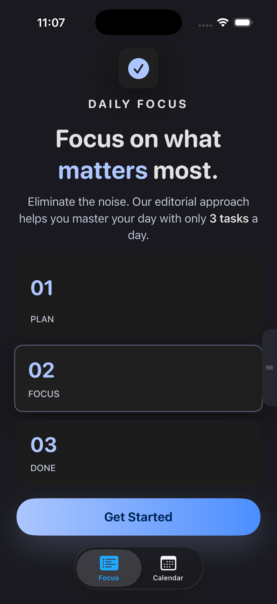
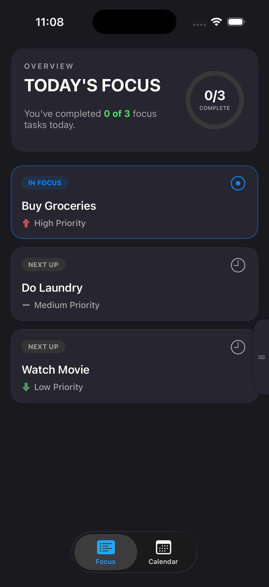
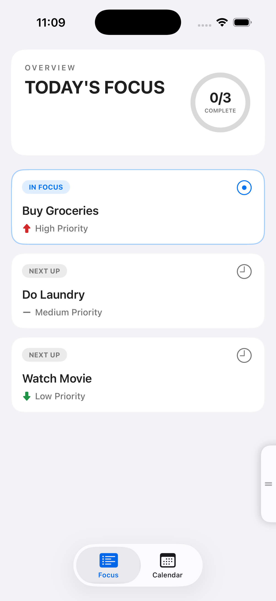
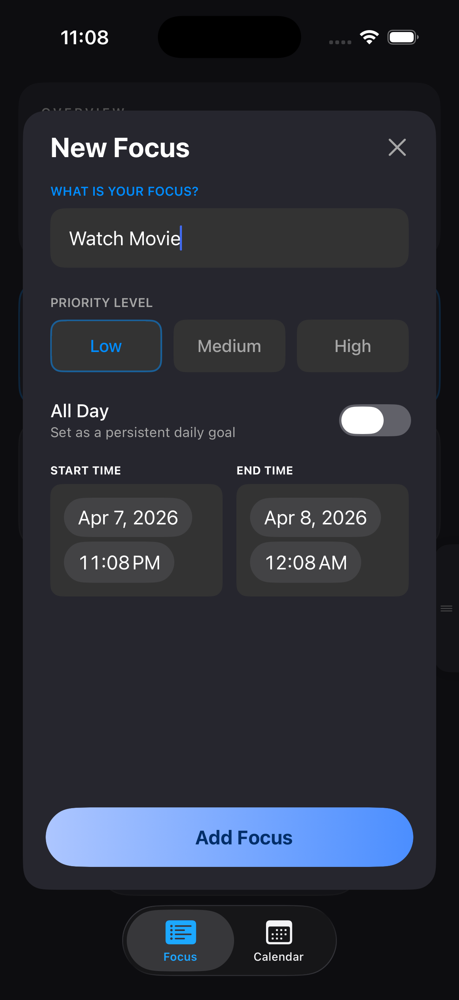
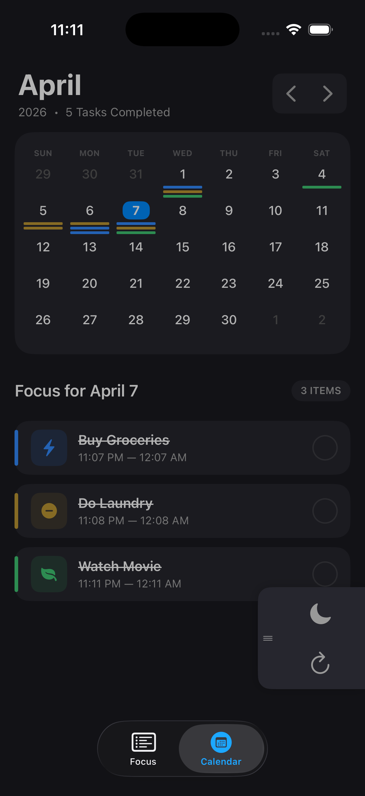
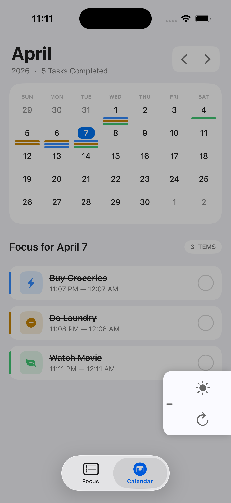
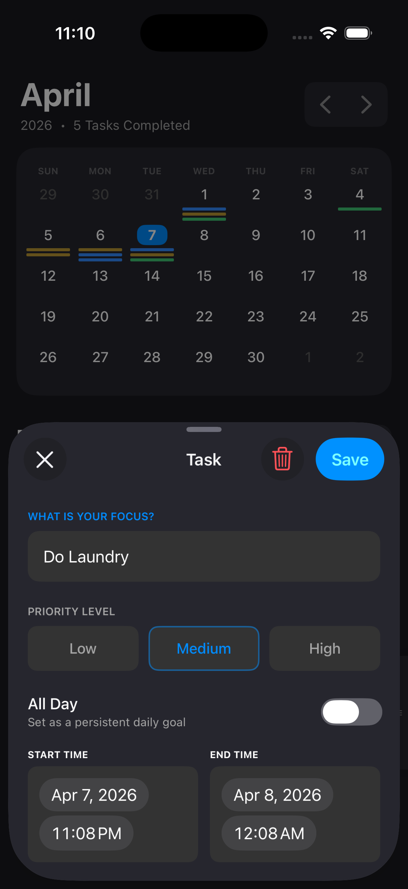

# Daily Focus

> **An opinionated iOS productivity app built around one idea: three tasks a day, nothing more.**

Daily Focus is a native iOS application that enforces a hard limit of three focus tasks per day. The constraint is intentional — the app is designed to push you to be selective about what actually matters, rather than maintaining an endless to-do list. When your three tasks are done, you're done.

---

## Screenshots

<p align="center">
  
  &nbsp;&nbsp;
  
  &nbsp;&nbsp;
  
  &nbsp;&nbsp;
  
</p>

<p align="center">
  <sub>Onboarding &nbsp;&nbsp;&nbsp;&nbsp;&nbsp;&nbsp;&nbsp;&nbsp;&nbsp;&nbsp;&nbsp;&nbsp;&nbsp;&nbsp;&nbsp;&nbsp;
  Focus – Dark &nbsp;&nbsp;&nbsp;&nbsp;&nbsp;&nbsp;&nbsp;&nbsp;&nbsp;&nbsp;&nbsp;&nbsp;&nbsp;
  Focus – Light &nbsp;&nbsp;&nbsp;&nbsp;&nbsp;&nbsp;&nbsp;&nbsp;&nbsp;&nbsp;&nbsp;&nbsp;&nbsp;
  Add Task</sub>
</p>

<br/>

<p align="center">
  
  &nbsp;&nbsp;
  
  &nbsp;&nbsp;
  
</p>

<p align="center">
  <sub>Calendar – Dark &nbsp;&nbsp;&nbsp;&nbsp;&nbsp;&nbsp;&nbsp;&nbsp;&nbsp;&nbsp;&nbsp;&nbsp;
  Calendar – Light &nbsp;&nbsp;&nbsp;&nbsp;&nbsp;&nbsp;&nbsp;&nbsp;&nbsp;&nbsp;&nbsp;&nbsp;
  Task Detail</sub>
</p>

---

## Features

### Focus Tab
- **3-task daily limit** — enforced at every entry point with a clear error message if you hit the ceiling
- **Task states** — each task is automatically classified as *In Focus* (the first uncompleted task), *Next Up*, or *Completed*, with distinct visual styling for each
- **Priority sorting** — tasks are sorted High → Medium → Low; tasks of equal priority keep their original insertion order (stable sort)
- **Completion toggle** — tap the action icon on any card to mark it complete / incomplete
- **Swipe to delete** — standard iOS trailing swipe on any task card
- **Carried-over tag** — tasks flagged as carried over from a previous day show an orange "CARRIED OVER" badge
- **Overview card** — animated circular progress ring in the header shows how many of today's tasks are done, with a live "X of Y" count
- **Completion celebration** — full-screen confetti animation (DotLottie) fires when all tasks are marked complete; plays only once per day
- **Empty state** — first-launch onboarding screen with brand copy, three bento-style step cards, and a gradient CTA button
- **Add task sheet** — centred modal overlay with a text field, Low / Medium / High priority selector, All Day toggle, and start / end time pickers

### Calendar Tab
- **Monthly calendar grid** — navigate by month; shows priority-coloured task stripes beneath each date
  - Blue (high priority), amber (medium), green (low)
  - Selected day rendered as a filled accent-coloured rounded square
  - Today (when not selected) rendered with accent-coloured number text
- **Month navigation** — left/right chevron pill to step between months
- **Month header** — large month name with year and "X Tasks Completed" subtitle, computed live from the displayed month's data
- **Day agenda** — tapping any date updates the "Focus for {Month Day}" panel below the grid, listing that day's tasks with a left priority border, icon box, title, time range, and a circle completion toggle
- **Add task FAB** — floating "+" button appears when the selected day has fewer than 3 tasks
- **Swipe to delete** on any calendar task card
- **Task detail sheet** — tap any card to edit title, priority, all-day flag, and start/end times

### Cross-Cutting
- **Light & Dark mode** — entire colour system defined as adaptive `UIColor` instances in `AppTheme`; no hard-coded colours anywhere in UI code
- **Appearance toggle** — side drawer lets you switch between light and dark regardless of the system setting, persisted across launches
- **Side tools drawer** — slides in from either screen edge via a drag gesture; remembers which edge and vertical position between sessions; contains the appearance toggle and a daily reset button
- **Auto midnight refresh** — listens for `UIApplication.significantTimeChangeNotification` and refreshes both tabs when the calendar day rolls over
- **Data migration** — `PersistenceManager` automatically upgrades the old flat-array storage format to the current day-keyed dictionary format, and fills in default values for any missing fields from earlier model versions

---

## Tech Stack

| Layer | Technology |
|---|---|
| Language | Swift 5 |
| UI Framework | UIKit — 100% programmatic Auto Layout, zero Storyboards or XIBs |
| Reactive bindings | Combine (`@Published` + `sink` for ViewModel → ViewController) |
| Animation | Core Animation (`CAShapeLayer`, `CAGradientLayer`, `CABasicAnimation`) |
| Lottie animation | [DotLottie iOS SDK](https://github.com/LottieFiles/dotlottie-ios) |
| Persistence | `UserDefaults` + `JSONEncoder` / `JSONDecoder` |
| Minimum deployment | iOS 16 |
| Architecture | MVVM — `TaskViewModel` owns data and business logic; ViewControllers own layout and interaction |

---

## What I Learned

Building this project end-to-end without Interface Builder was a genuine deep dive into UIKit. Key takeaways:

- **Programmatic Auto Layout at scale** — chaining complex constraint trees across custom `UIView` subclasses, using `intrinsicContentSize`, `contentCompressionResistancePriority`, and `UIStackView` axes to avoid ambiguity without magic numbers
- **CALayer-based custom drawing** — building the circular progress ring entirely with `CAShapeLayer` + `CABasicAnimation`, and compositing `CAGradientLayer` onto a `UIButton` with correct frame lifecycle (`layoutSubviews` for gradient resizing)
- **Combine in practice** — connecting a `@Published` array in the ViewModel to the ViewController with `sink`, handling thread dispatch back to main, and managing `AnyCancellable` lifetime with `Set<AnyCancellable>`
- **Stable sort in Swift** — Swift's `Array.sorted` is stable (documented since Swift 5), making it safe to sort by priority while preserving relative insertion order within priority groups
- **UICollectionView for a calendar grid** — driving a 7-column month grid with `UICollectionViewFlowLayout`, computing leading padding cells for the first weekday, and dynamically updating the height constraint as the number of rows changes between 5 and 6
- **Screen-edge pan gestures** — combining `UIScreenEdgePanGestureRecognizer` with `UIPanGestureRecognizer` for the side drawer, with axis-locking logic to distinguish a horizontal open gesture from a vertical reposition drag
- **UserDefaults data migration** — writing forward-compatible `Decodable` `init(from:)` with `decodeIfPresent` so existing users' data survives model changes without a separate migration script
- **DotLottie integration** — embedding a `.lottie` bundle file and loading it at runtime via the DotLottie Swift SDK, with proper play/pause lifecycle tied to the view hierarchy
- **Semantic colour system** — defining every colour as a `UIColor { traitCollection in ... }` closure in a single `AppTheme` enum so every view automatically responds to dark/light mode transitions

---

## Project Structure

```
Daily Focus/
├── App/
│   ├── AppDelegate.swift          # UIApplicationDelegate, appearance applied at launch
│   └── SceneDelegate.swift        # UIWindowScene setup
│
├── Model/
│   └── FocusTask.swift            # FocusTask struct, TaskPriority enum, TaskFormPayload
│
├── ViewModel/
│   ├── TaskViewModel.swift        # Business logic, Combine @Published tasks, stable sort
│   └── TaskError.swift            # LocalizedError cases: limitReached, emptyTitle
│
├── View/
│   ├── MainTabBarController.swift            # Root tab bar (Focus + Calendar tabs)
│   │
│   ├── ── Focus Tab ─────────────────────────────────────────────────────────
│   ├── TaskListViewController.swift          # Main focus screen; Combine binding to ViewModel
│   ├── TaskListHeaderView.swift              # Overview card + CircularProgressView
│   ├── TaskListFooterView.swift              # "Add New Focus" pill button + message label
│   ├── TaskCardCell.swift                    # UITableViewCell; TaskDisplayState styling
│   ├── EmptyStateView.swift                  # First-launch onboarding / empty state
│   ├── CompletionCelebrationView.swift       # DotLottie confetti overlay
│   │
│   ├── ── Calendar Tab ──────────────────────────────────────────────────────
│   ├── CalendarViewController.swift          # Month + day agenda, FAB, data persistence
│   ├── MonthCalendarView.swift               # UICollectionView month grid + Stitch header
│   ├── CalendarEventCell.swift               # Stitch-style calendar task card
│   ├── TaskCalendarDetailViewController.swift # Edit/delete sheet for calendar tasks
│   │
│   ├── ── Shared ────────────────────────────────────────────────────────────
│   ├── AddTaskSheetView.swift         # Centred modal overlay for adding tasks
│   ├── TaskFormView.swift             # Reusable form (title, priority, timing)
│   └── SideToolsDrawerView.swift      # Edge-pinned drawer (appearance toggle + reset)
│
├── Service/
│   ├── PersistenceManager.swift           # UserDefaults JSON read/write + migration
│   └── PersistenceManagerProtocol.swift   # Protocol for testability
│
├── Theme/
│   ├── AppTheme.swift             # All adaptive UIColor tokens
│   └── AppearanceManager.swift    # Light/dark preference, persisted, broadcast via NotificationCenter
│
├── Utilities/
│   └── DayKey.swift               # "yyyy-MM-dd" string ↔ Date helpers
│
├── Resources/
│   └── Confetti.lottie            # DotLottie animation file
│
└── SCREENS/                       # App screenshots
    ├── 01-onboarding.png
    ├── 02-add-task.png
    ├── 03-focus-dark.png
    ├── 04-focus-light.png
    ├── 05-task-detail.png
    ├── 06-calendar-light.png
    └── 07-calendar-dark.png
```

---

## Getting Started

### Prerequisites
- Xcode 15 or later
- iOS 16+ device or simulator
- Swift Package Manager (dependencies resolve automatically on first build)

### Install & Run

```bash
git clone https://github.com/<your-username>/daily-focus.git
cd daily-focus
open "Daily Focus.xcodeproj"
```

Select a simulator or connected device and press **⌘R**.

> No API keys, no backend, no configuration needed. All data lives in the app's local `UserDefaults` sandbox.

---

## Dependencies

| Package | Purpose |
|---|---|
| [dotlottie-ios](https://github.com/LottieFiles/dotlottie-ios) | Confetti animation on all-tasks-complete |

Managed via Swift Package Manager — Xcode resolves it automatically.

---

## Project Status

**This project is feature-complete from the author's perspective.** I am no longer actively developing or adding new features. The codebase is stable and all the functionality I set out to build is done.

That said, **contributions are very welcome!** If you spot a bug, have an idea, or want to extend the app, feel free to open a pull request or an issue. Some directions that could be interesting:

- iCloud / CloudKit sync
- Home screen widget
- Local notifications / reminders for scheduled tasks
- Haptic feedback on completion
- iPad adaptive layout
- Unit & UI tests for `TaskViewModel` and `PersistenceManager`
- Accessibility improvements (VoiceOver labels, Dynamic Type support)

---

## Contributing

1. Fork the repository
2. Create a feature branch: `git checkout -b feature/your-idea`
3. Commit your changes: `git commit -m 'Add your feature'`
4. Push to the branch: `git push origin feature/your-idea`
5. Open a pull request

Please keep PRs focused — one feature or fix per PR makes review much easier.

---

## License

This project is available under the [MIT License](LICENSE).

---

*Built with UIKit, Combine, and the conviction that three tasks a day is enough.*
